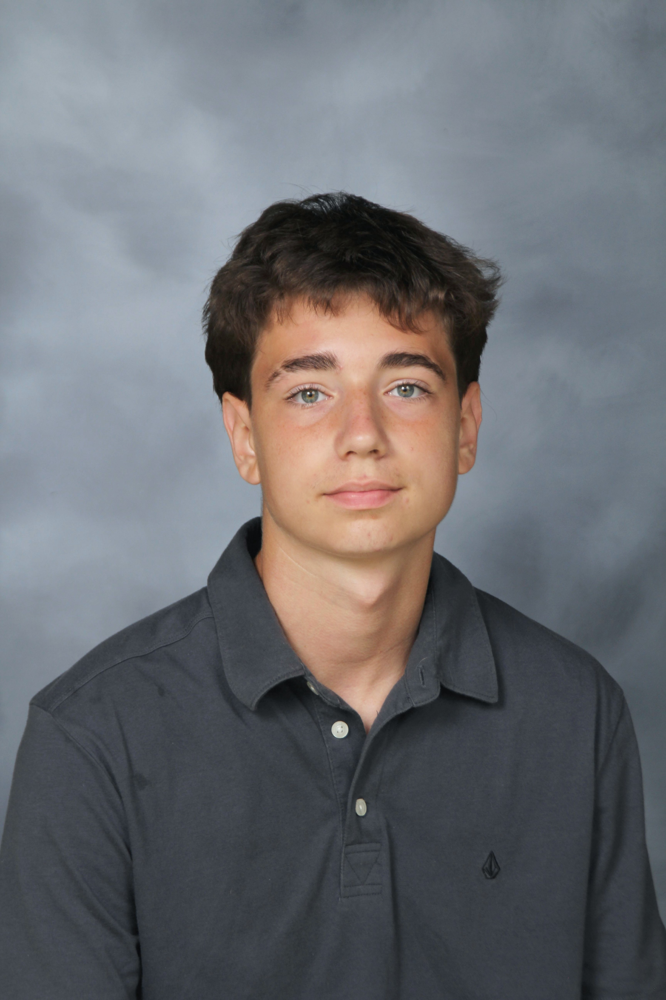

# Frutiger Aero Homepage Redesign - Complete Implementation Guide
## Windows Vista/XP Aesthetic - Atomic Step-by-Step Design Document

---

## 🎯 Executive Summary

This document provides **atomic, step-by-step instructions** for completely redesigning the homepage to achieve an authentic **Frutiger Aero aesthetic** inspired by **Windows Vista and XP**. The design will be **highly animated, interactive, and visually stunning** - anything but static.

**Key Principles:**
- Complete removal of current UI elements
- Windows Vista Aero Glass effects throughout
- Animated background with multiple layers
- Interactive elements with smooth transitions
- Modern implementation using Tailwind CSS
- Performance-optimized animations

---

## 📚 Part 1: Understanding Frutiger Aero & Windows Vista/XP Aesthetic

### Core Visual Characteristics

1. **Aero Glass (Windows Vista)**
   - Translucent, frosted glass panels
   - Backdrop blur effects
   - Subtle borders with inner highlights
   - Depth through layered shadows
   - Reflective surfaces

2. **Color Palette**
   - **Sky Blues**: #87CEEB, #00BFFF, #1E90FF, #4682B4
   - **Nature Greens**: #00FF7F, #7FFF00, #00C853, #228B22
   - **Accent Oranges**: #FF8C00, #FF6B35
   - **Whites**: #FFFFFF, #F8F8FF (with transparency)
   - **Metallics**: #C0C0C0, #E8E8E8

3. **Typography**
   - **Primary**: Segoe UI (Windows Vista default)
   - **Secondary**: Calibri, Tahoma
   - Text shadows for depth
   - Clear, readable hierarchy

4. **Visual Elements**
   - Glossy, reflective surfaces
   - Smooth gradients
   - Nature-tech fusion (water, sky, grass, bubbles)
   - Optimistic, futuristic feel
   - Depth and layering

5. **Animations**
   - Smooth, organic motion
   - Parallax scrolling
   - Hover effects with glow
   - Floating elements
   - Water ripple effects

---

## 🛠️ Part 2: Technology Stack Setup

### STEP 1: Install Tailwind CSS
**File**: `package.json` (create if doesn't exist)

**Action**:
```bash
npm init -y
npm install -D tailwindcss postcss autoprefixer
npx tailwindcss init -p
```

**Create `tailwind.config.js`**:
```javascript
module.exports = {
  content: ["./index.html", "./js/**/*.js"],
  theme: {
    extend: {
      colors: {
        'sky-blue': '#00BFFF',
        'bright-blue': '#1E90FF',
        'light-blue': '#87CEEB',
        'fresh-green': '#00FF7F',
        'lime-green': '#7FFF00',
        'emerald': '#00C853',
        'glowing-orange': '#FF8C00',
      },
      fontFamily: {
        'vista': ['Segoe UI', 'Calibri', 'sans-serif'],
      },
      backdropBlur: {
        'vista': '25px',
      },
    },
  },
  plugins: [],
}
```

**Create `postcss.config.js`**:
```javascript
module.exports = {
  plugins: {
    tailwindcss: {},
    autoprefixer: {},
  },
}
```

**Update `package.json` scripts**:
```json
{
  "scripts": {
    "build-css": "tailwindcss -i ./css/input.css -o ./css/style.css --watch"
  }
}
```

**Create `css/input.css`**:
```css
@tailwind base;
@tailwind components;
@tailwind utilities;

@layer base {
  @import url('https://fonts.googleapis.com/css2?family=Segoe+UI:wght@300;400;500;600;700&display=swap');
  
  body {
    font-family: 'Segoe UI', -apple-system, BlinkMacSystemFont, sans-serif;
  }
}
```

---

## 🎨 Part 3: Complete Homepage HTML Structure

### STEP 2: Replace index.html Structure
**File**: `index.html`

**Action**: Completely replace the body content with this structure:

```html
<!DOCTYPE html>
<html lang="en" data-theme="light">
<head>
    <meta charset="UTF-8">
    <meta name="viewport" content="width=device-width, initial-scale=1.0">
    <title>Ian McCallum | Young Entrepreneur</title>
    
    <!-- SEO Meta Tags (keep existing) -->
    <!-- ... existing meta tags ... -->
    
    <!-- Stylesheets -->
    <link rel="stylesheet" href="css/style.css">
    <link rel="stylesheet" href="https://cdnjs.cloudflare.com/ajax/libs/font-awesome/6.5.1/css/all.min.css">
    <link rel="icon" type="image/png" href="img/IMlogo.png">
</head>

<body class="overflow-x-hidden">
    <!-- ============================================
         WINDOWS VISTA AERO BACKGROUND LAYERS
         ============================================ -->
    <div id="frutiger-background" class="fixed inset-0 z-0">
        <!-- Sky Gradient Base -->
        <div class="sky-base absolute inset-0"></div>
        
        <!-- Animated Clouds Layer -->
        <div class="clouds-layer absolute inset-0"></div>
        
        <!-- Distant City Skyline -->
        <div class="city-skyline absolute inset-0"></div>
        
        <!-- Ocean/Water Layer -->
        <div class="ocean-layer absolute inset-0"></div>
        
        <!-- Rolling Green Hills -->
        <div class="hills-layer absolute inset-0"></div>
        
        <!-- Swimming Fish -->
        <div class="fish-container absolute inset-0"></div>
        
        <!-- Floating Glass Bubbles -->
        <div class="bubbles-container absolute inset-0"></div>
        
        <!-- Light Rays & Atmospheric Effects -->
        <div class="atmosphere-layer absolute inset-0"></div>
    </div>

    <!-- ============================================
         WINDOWS VISTA AERO GLASS CONTENT
         ============================================ -->
    <div class="content-wrapper relative z-10 min-h-screen">
        <!-- Vista-Style Theme Toggle -->
        <button id="theme-toggle" class="vista-glass-button fixed top-8 right-8 z-50" aria-label="Toggle Theme">
            <i class="fas fa-sun text-2xl"></i>
        </button>

        <!-- Hero Section - Vista Aero Glass Card -->
        <section class="hero min-h-screen flex items-center justify-center p-4">
            <div class="vista-glass-card max-w-4xl w-full mx-auto p-8 md:p-12">
                <!-- Profile Image with Vista Glow -->
                <div class="profile-image-wrapper mb-8 flex justify-center">
                    <div class="vista-glow-ring relative">
                        
                        <div class="vista-glow-effect"></div>
                    </div>
                </div>

                <!-- Bio Text with Vista Typography -->
                <div class="bio-text text-center mb-8">
                    <h1 class="vista-title text-5xl md:text-7xl font-bold mb-4">
                        Hey, I'm Ian
                    </h1>
                    <p class="vista-subtitle text-xl md:text-2xl mb-2">
                        Young Entrepreneur & Tech Innovator
                    </p>
                    <p class="vista-location text-lg flex items-center justify-center gap-2">
                        <i class="fas fa-map-marker-alt"></i>
                        Based in Naperville, Illinois
                    </p>
                </div>

                <!-- Vista-Style Navigation Buttons -->
                <div class="navigation-buttons flex flex-wrap justify-center gap-4 mb-8">
                    <div class="dropdown-wrapper relative">
                        <button class="vista-glass-button-nav group">
                            About <i class="fas fa-chevron-down ml-2 transition-transform group-hover:rotate-180"></i>
                        </button>
                        <div class="vista-dropdown-menu hidden group-hover:block">
                            <a href="about.html" class="vista-dropdown-item">Meet Ian</a>
                            <a href="cv.html" class="vista-dropdown-item">CV</a>
                            <a href="photos.html" class="vista-dropdown-item">Photos</a>
                        </div>
                    </div>
                    <a href="portfolio.html" class="vista-glass-button-nav">Portfolio</a>
                    <a href="testimonials.html" class="vista-glass-button-nav">Testimonials</a>
                    <a href="contact.html" class="vista-glass-button-nav">Contact</a>
                </div>

                <!-- Vista-Style Social Icons -->
                <div class="social-section text-center">
                    <h3 class="vista-section-title mb-6">Connect With Me</h3>
                    <div class="social-icons flex justify-center gap-6">
                        <a href="https://www.instagram.com/ianmccalum/" target="_blank" rel="noopener" 
                           class="vista-social-icon group">
                            <i class="fab fa-instagram"></i>
                            <div class="vista-icon-glow"></div>
                        </a>
                        <a href="https://x.com/ian_mccaIlum" target="_blank" rel="noopener" 
                           class="vista-social-icon group">
                            <i class="fab fa-twitter"></i>
                            <div class="vista-icon-glow"></div>
                        </a>
                        <a href="https://www.linkedin.com/in/ian-mccallum-700722344/" target="_blank" rel="noopener" 
                           class="vista-social-icon group">
                            <i class="fab fa-linkedin-in"></i>
                            <div class="vista-icon-glow"></div>
                        </a>
                    </div>
                </div>
            </div>
        </section>

        <!-- Vista-Style Footer -->
        <footer class="vista-glass-footer text-center py-6">
            <p class="vista-footer-text">&copy; 2024 Ian McCallum. All rights reserved.</p>
        </footer>
    </div>

    <!-- Scripts -->
    <script src="js/frutiger-background.js"></script>
    <script src="js/vista-interactions.js"></script>
    <script src="js/main.js"></script>
</body>
</html>
```

---

## 🎨 Part 4: Vista Aero Glass CSS Components

### STEP 3: Create Vista Glass Components
**File**: `css/style.css` (add to Tailwind output)

**Action**: Add these Vista Aero Glass component classes:

```css
/* ============================================
   WINDOWS VISTA AERO GLASS COMPONENTS
   ============================================ */

/* Vista Glass Card - Main Container */
.vista-glass-card {
    background: rgba(255, 255, 255, 0.2);
    backdrop-filter: blur(25px) saturate(180%);
    -webkit-backdrop-filter: blur(25px) saturate(180%);
    border: 1px solid rgba(255, 255, 255, 0.4);
    border-radius: 16px;
    box-shadow: 
        0 8px 32px rgba(0, 0, 0, 0.15),
        inset 0 1px 0 rgba(255, 255, 255, 0.5),
        inset 0 -1px 0 rgba(0, 0, 0, 0.1),
        0 0 60px rgba(0, 191, 255, 0.2);
    position: relative;
    overflow: hidden;
    animation: vistaFloat 6s ease-in-out infinite;
}

.vista-glass-card::before {
    content: '';
    position: absolute;
    top: -50%;
    right: -50%;
    width: 200%;
    height: 200%;
    background: radial-gradient(circle, rgba(0, 255, 127, 0.1) 0%, transparent 70%);
    animation: vistaGlow 8s ease-in-out infinite;
    pointer-events: none;
}

/* Vista Glass Buttons */
.vista-glass-button,
.vista-glass-button-nav {
    background: rgba(255, 255, 255, 0.2);
    backdrop-filter: blur(15px) saturate(180%);
    -webkit-backdrop-filter: blur(15px) saturate(180%);
    border: 1px solid rgba(255, 255, 255, 0.4);
    border-radius: 12px;
    padding: 12px 24px;
    color: #0a0a0a;
    font-weight: 600;
    font-size: 1rem;
    transition: all 0.4s cubic-bezier(0.4, 0, 0.2, 1);
    box-shadow: 
        0 4px 16px rgba(0, 0, 0, 0.1),
        inset 0 1px 0 rgba(255, 255, 255, 0.5);
    position: relative;
    overflow: hidden;
    cursor: pointer;
    text-decoration: none;
    display: inline-flex;
    align-items: center;
    justify-content: center;
}

.vista-glass-button::before,
.vista-glass-button-nav::before {
    content: '';
    position: absolute;
    top: 50%;
    left: 50%;
    width: 0;
    height: 0;
    border-radius: 50%;
    background: radial-gradient(circle, rgba(0, 255, 127, 0.3) 0%, transparent 70%);
    transform: translate(-50%, -50%);
    transition: all 0.6s cubic-bezier(0.4, 0, 0.2, 1);
}

.vista-glass-button:hover::before,
.vista-glass-button-nav:hover::before {
    width: 300px;
    height: 300px;
}

.vista-glass-button:hover,
.vista-glass-button-nav:hover {
    transform: translateY(-3px) scale(1.05);
    box-shadow: 
        0 8px 24px rgba(0, 0, 0, 0.2),
        0 0 30px rgba(0, 255, 127, 0.4),
        inset 0 1px 0 rgba(255, 255, 255, 0.6);
    border-color: rgba(0, 255, 127, 0.5);
    color: #00FF7F;
}

/* Vista Title Typography */
.vista-title {
    background: linear-gradient(135deg, #1E90FF 0%, #00BFFF 50%, #00FF7F 100%);
    -webkit-background-clip: text;
    -webkit-text-fill-color: transparent;
    background-clip: text;
    filter: drop-shadow(0 4px 20px rgba(0, 191, 255, 0.5));
    animation: vistaShimmer 3s linear infinite;
    background-size: 200% auto;
}

.vista-subtitle {
    color: #0a0a0a;
    text-shadow: 
        0 3px 6px rgba(255, 255, 255, 0.95),
        0 0 20px rgba(255, 255, 255, 0.7),
        2px 2px 4px rgba(0, 0, 0, 0.3);
    font-weight: 600;
}

.vista-location {
    color: #0a0a0a;
    text-shadow: 0 2px 10px rgba(255, 255, 255, 0.8);
}

/* Vista Profile Image Glow */
.vista-glow-ring {
    position: relative;
    display: inline-block;
}

.vista-glow-effect {
    position: absolute;
    inset: -10px;
    border-radius: 50%;
    background: radial-gradient(circle, rgba(0, 191, 255, 0.4) 0%, transparent 70%);
    animation: vistaPulse 3s ease-in-out infinite;
    pointer-events: none;
}

.profile-image {
    position: relative;
    z-index: 2;
    animation: vistaFloat 6s ease-in-out infinite;
    transition: transform 0.4s cubic-bezier(0.4, 0, 0.2, 1);
}

.profile-image:hover {
    transform: scale(1.05);
    box-shadow: 
        0 25px 70px rgba(0, 0, 0, 0.4),
        0 0 60px rgba(0, 255, 127, 0.6);
}

/* Vista Social Icons */
.vista-social-icon {
    width: 70px;
    height: 70px;
    border-radius: 50%;
    background: rgba(255, 255, 255, 0.2);
    backdrop-filter: blur(20px) saturate(180%);
    -webkit-backdrop-filter: blur(20px) saturate(180%);
    border: 2px solid rgba(255, 255, 255, 0.4);
    display: flex;
    align-items: center;
    justify-content: center;
    color: #1E90FF;
    font-size: 1.8rem;
    text-decoration: none;
    transition: all 0.4s cubic-bezier(0.4, 0, 0.2, 1);
    box-shadow: 0 8px 32px rgba(0, 0, 0, 0.1);
    position: relative;
    overflow: hidden;
}

.vista-icon-glow {
    position: absolute;
    inset: 0;
    border-radius: 50%;
    background: radial-gradient(circle, rgba(0, 191, 255, 0.4) 0%, transparent 70%);
    opacity: 0;
    transition: opacity 0.4s;
}

.vista-social-icon:hover .vista-icon-glow {
    opacity: 1;
}

.vista-social-icon:hover {
    transform: translateY(-8px) scale(1.15) rotate(10deg);
    box-shadow: 
        0 12px 48px rgba(0, 0, 0, 0.2),
        0 0 40px rgba(0, 191, 255, 0.6);
    border-color: rgba(0, 191, 255, 0.6);
    color: #1E90FF;
}

/* Vista Dropdown Menu */
.dropdown-wrapper {
    position: relative;
}

.vista-dropdown-menu {
    position: absolute;
    top: calc(100% + 10px);
    left: 50%;
    transform: translateX(-50%);
    background: rgba(255, 255, 255, 0.2);
    backdrop-filter: blur(25px) saturate(200%);
    -webkit-backdrop-filter: blur(25px) saturate(200%);
    border: 1px solid rgba(255, 255, 255, 0.4);
    border-radius: 12px;
    padding: 1rem;
    min-width: 200px;
    box-shadow: 
        0 8px 32px rgba(0, 0, 0, 0.15),
        0 0 40px rgba(0, 191, 255, 0.3);
    z-index: 100;
}

.vista-dropdown-item {
    display: block;
    padding: 0.75rem 1.25rem;
    color: #0a0a0a;
    text-decoration: none;
    border-radius: 8px;
    transition: all 0.3s;
    font-weight: 500;
    margin-bottom: 0.5rem;
}

.vista-dropdown-item:hover {
    background: rgba(0, 255, 127, 0.2);
    color: #00FF7F;
    transform: translateX(5px);
    box-shadow: 0 4px 15px rgba(0, 255, 127, 0.3);
}

/* Vista Footer */
.vista-glass-footer {
    background: rgba(255, 255, 255, 0.15);
    backdrop-filter: blur(20px) saturate(180%);
    -webkit-backdrop-filter: blur(20px) saturate(180%);
    border-top: 1px solid rgba(255, 255, 255, 0.3);
}

.vista-footer-text {
    color: #0a0a0a;
    text-shadow: 0 2px 10px rgba(255, 255, 255, 0.8);
}

.vista-section-title {
    font-size: 1.3rem;
    font-weight: 600;
    text-transform: uppercase;
    letter-spacing: 3px;
    color: #0a0a0a;
    text-shadow: 0 2px 10px rgba(255, 255, 255, 0.8);
}

/* Vista Animations */
@keyframes vistaFloat {
    0%, 100% { transform: translateY(0px) rotate(0deg); }
    50% { transform: translateY(-20px) rotate(2deg); }
}

@keyframes vistaGlow {
    0%, 100% { opacity: 0.5; transform: rotate(0deg); }
    50% { opacity: 1; transform: rotate(180deg); }
}

@keyframes vistaShimmer {
    0% { background-position: -200% center; }
    100% { background-position: 200% center; }
}

@keyframes vistaPulse {
    0%, 100% { 
        opacity: 0.6;
        transform: scale(1);
    }
    50% { 
        opacity: 1;
        transform: scale(1.1);
    }
}
```

---

## 🌊 Part 5: Animated Background System

### STEP 4: Create Background JavaScript
**File**: `js/frutiger-background.js`

**Action**: Create comprehensive animated background system:

```javascript
// ============================================
// FRUTIGER AERO ANIMATED BACKGROUND SYSTEM
// Windows Vista/XP Inspired
// ============================================

class FrutigerBackgroundSystem {
    constructor() {
        this.init();
    }

    init() {
        this.createSkyBase();
        this.createClouds();
        this.createCitySkyline();
        this.createOcean();
        this.createHills();
        this.createFish();
        this.createBubbles();
        this.createAtmosphere();
        this.startAnimations();
    }

    // Sky Gradient Base
    createSkyBase() {
        const skyBase = document.querySelector('.sky-base');
        if (!skyBase) return;
        
        skyBase.style.cssText = `
            background: linear-gradient(to bottom, 
                #87CEEB 0%, 
                #00BFFF 25%, 
                #1E90FF 50%, 
                #4682B4 75%,
                #5F9EA0 100%
            );
            z-index: 1;
        `;
    }

    // Animated Clouds
    createClouds() {
        const cloudsLayer = document.querySelector('.clouds-layer');
        if (!cloudsLayer) return;

        const cloudCount = 12;
        for (let i = 0; i < cloudCount; i++) {
            const cloud = document.createElement('div');
            cloud.className = `cloud cloud-${i + 1}`;
            
            const size = 150 + Math.random() * 100;
            const top = 5 + Math.random() * 40;
            const left = -20 + Math.random() * 20;
            const speed = 20 + Math.random() * 30;
            const delay = Math.random() * 30;
            
            cloud.style.cssText = `
                position: absolute;
                width: ${size}px;
                height: ${size * 0.5}px;
                top: ${top}%;
                left: ${left}%;
                background: rgba(255, 255, 255, 0.8);
                border-radius: 50px;
                filter: blur(40px);
                animation: cloudFloat${i + 1} ${speed}s linear infinite;
                animation-delay: ${delay}s;
            `;
            
            cloudsLayer.appendChild(cloud);
            
            // Add keyframes dynamically
            this.addCloudAnimation(i + 1, speed);
        }
    }

    addCloudAnimation(index, duration) {
        const style = document.createElement('style');
        style.textContent = `
            @keyframes cloudFloat${index} {
                0% { transform: translateX(0) translateY(0); }
                50% { transform: translateX(0) translateY(${-10 + Math.random() * 20}px); }
                100% { transform: translateX(calc(100vw + 300px)) translateY(0); }
            }
        `;
        document.head.appendChild(style);
    }

    // City Skyline
    createCitySkyline() {
        const cityLayer = document.querySelector('.city-skyline');
        if (!cityLayer) return;

        const buildingCount = 20;
        for (let i = 0; i < buildingCount; i++) {
            const building = document.createElement('div');
            building.className = 'city-building';
            
            const width = 30 + Math.random() * 50;
            const height = 100 + Math.random() * 150;
            const left = (i / buildingCount) * 100;
            
            building.style.cssText = `
                position: absolute;
                bottom: 35%;
                left: ${left}%;
                width: ${width}px;
                height: ${height}px;
                background: linear-gradient(to top, 
                    rgba(20, 40, 80, 0.6) 0%,
                    rgba(30, 60, 100, 0.4) 50%,
                    rgba(40, 80, 120, 0.2) 100%
                );
                clip-path: polygon(
                    0% 100%, 
                    20% ${100 - (height * 0.1)}%, 
                    50% ${100 - (height * 0.2)}%, 
                    80% ${100 - (height * 0.15)}%, 
                    100% 100%
                );
                box-shadow: 
                    inset -10px 0 30px rgba(0, 0, 0, 0.3),
                    inset 10px 0 30px rgba(255, 255, 255, 0.2),
                    0 0 40px rgba(0, 191, 255, 0.3);
            `;
            
            // Add windows
            this.addBuildingWindows(building, width, height);
            
            cityLayer.appendChild(building);
        }
    }

    addBuildingWindows(building, width, height) {
        const windowRows = Math.floor(height / 25);
        const windowCols = 3;
        
        for (let row = 0; row < windowRows; row++) {
            for (let col = 0; col < windowCols; col++) {
                if (Math.random() > 0.3) {
                    const window = document.createElement('div');
                    window.style.cssText = `
                        position: absolute;
                        left: ${(col + 1) * (width / (windowCols + 1)) - 4}px;
                        top: ${row * 25 + 5}px;
                        width: 8px;
                        height: 10px;
                        background: rgba(255, 255, 150, ${0.3 + Math.random() * 0.5});
                        border-radius: 2px;
                        animation: windowBlink ${3 + Math.random() * 4}s ease-in-out infinite;
                    `;
                    building.appendChild(window);
                }
            }
        }
    }

    // Ocean Layer
    createOcean() {
        const oceanLayer = document.querySelector('.ocean-layer');
        if (!oceanLayer) return;

        const canvas = document.createElement('canvas');
        canvas.id = 'ocean-canvas';
        canvas.style.cssText = `
            position: absolute;
            bottom: 25%;
            left: 0;
            width: 100%;
            height: 15%;
            z-index: 4;
        `;
        oceanLayer.appendChild(canvas);

        this.animateOcean(canvas);
    }

    animateOcean(canvas) {
        const ctx = canvas.getContext('2d');
        let time = 0;

        function resize() {
            canvas.width = window.innerWidth;
            canvas.height = window.innerHeight * 0.15;
        }

        function draw() {
            ctx.clearRect(0, 0, canvas.width, canvas.height);
            time += 0.02;

            // Ocean gradient
            const gradient = ctx.createLinearGradient(0, 0, 0, canvas.height);
            gradient.addColorStop(0, 'rgba(0, 191, 255, 0.4)');
            gradient.addColorStop(0.5, 'rgba(30, 144, 255, 0.5)');
            gradient.addColorStop(1, 'rgba(0, 100, 200, 0.5)');

            ctx.fillStyle = gradient;
            ctx.beginPath();
            ctx.moveTo(0, canvas.height);

            // Wave pattern
            for (let x = 0; x <= canvas.width; x += 2) {
                const y = canvas.height / 2 + 
                    Math.sin(x * 0.02 + time) * 15 +
                    Math.sin(x * 0.04 + time * 1.5) * 8 +
                    Math.sin(x * 0.01 + time * 0.8) * 5;
                ctx.lineTo(x, y);
            }

            ctx.lineTo(canvas.width, canvas.height);
            ctx.closePath();
            ctx.fill();

            // Highlights
            for (let i = 0; i < 3; i++) {
                const highlightX = ((time * 50 + i * canvas.width / 3) % (canvas.width + 200)) - 100;
                const highlightY = canvas.height / 2 + Math.sin(highlightX * 0.02 + time) * 15;

                const highlightGradient = ctx.createRadialGradient(
                    highlightX, highlightY, 0,
                    highlightX, highlightY, 100
                );
                highlightGradient.addColorStop(0, 'rgba(255, 255, 255, 0.4)');
                highlightGradient.addColorStop(1, 'rgba(255, 255, 255, 0)');

                ctx.fillStyle = highlightGradient;
                ctx.beginPath();
                ctx.arc(highlightX, highlightY, 80, 0, Math.PI * 2);
                ctx.fill();
            }

            requestAnimationFrame(draw);
        }

        resize();
        draw();
        window.addEventListener('resize', resize);
    }

    // Rolling Hills
    createHills() {
        const hillsLayer = document.querySelector('.hills-layer');
        if (!hillsLayer) return;

        const hillColors = [
            ['#00C853', '#00FF7F', '#7FFF00', '#98FB98'],
            ['#228B22', '#00C853', '#00FF7F', '#7FFF00'],
            ['#2F4F2F', '#228B22', '#00C853', '#00FF7F'],
        ];

        for (let i = 0; i < 3; i++) {
            const hill = document.createElement('div');
            hill.className = `hill hill-${i + 1}`;
            
            const height = [25, 20, 15][i];
            const opacity = [0.95, 0.85, 0.75][i];
            const offset = i * 2;
            
            hill.style.cssText = `
                position: absolute;
                bottom: 0;
                left: ${-offset}%;
                width: ${100 + offset * 2}%;
                height: ${height}%;
                background: linear-gradient(to top, ${hillColors[i].join(', ')});
                clip-path: polygon(
                    0% 100%, 
                    3% 98%, 7% 95%, 12% 92%, 18% 88%, 25% 85%,
                    32% 82%, 40% 80%, 48% 78%, 55% 80%, 62% 82%, 70% 85%,
                    77% 88%, 83% 92%, 88% 95%, 93% 98%, 97% 99%, 100% 100%
                );
                opacity: ${opacity};
                animation: hillWave${i + 1} ${8 + i * 2}s ease-in-out infinite;
                z-index: ${5 - i};
            `;
            
            hillsLayer.appendChild(hill);
            this.addHillAnimation(i + 1);
        }
    }

    addHillAnimation(index) {
        const style = document.createElement('style');
        style.textContent = `
            @keyframes hillWave${index} {
                0%, 100% { transform: translateX(0) translateY(0); }
                25% { transform: translateX(${Math.random() * 4 - 2}px) translateY(${-3 - index}px); }
                50% { transform: translateX(0) translateY(${-5 - index * 2}px); }
                75% { transform: translateX(${Math.random() * 4 - 2}px) translateY(${-3 - index}px); }
            }
        `;
        document.head.appendChild(style);
    }

    // Swimming Fish
    createFish() {
        const fishContainer = document.querySelector('.fish-container');
        if (!fishContainer) return;

        const fishCount = 10;
        const fishColors = [
            ['#00BFFF', '#1E90FF', '#00CED1'],
            ['#00FF7F', '#7FFF00', '#00C853'],
            ['#FF8C00', '#FF6B35', '#FFA500'],
            ['#9370DB', '#4169E1', '#00BFFF'],
        ];

        for (let i = 0; i < fishCount; i++) {
            const fish = document.createElement('div');
            fish.className = `fish fish-${i + 1}`;
            
            const colorSet = fishColors[i % fishColors.length];
            const size = 50 + Math.random() * 30;
            const top = 20 + Math.random() * 60;
            const duration = 20 + Math.random() * 10;
            const delay = Math.random() * 20;
            const direction = Math.random() > 0.5 ? 1 : -1;
            
            fish.style.cssText = `
                position: absolute;
                width: ${size}px;
                height: ${size * 0.6}px;
                top: ${top}%;
                left: ${direction > 0 ? '-10%' : '110%'};
                background: linear-gradient(135deg, ${colorSet.join(', ')});
                clip-path: polygon(0% 50%, 15% 0%, 85% 0%, 100% 50%, 85% 100%, 15% 100%);
                box-shadow: 0 0 15px rgba(${this.hexToRgb(colorSet[0])}, 0.4);
                animation: fishSwim${i + 1} ${duration}s ease-in-out infinite;
                animation-delay: ${delay}s;
                z-index: 3;
            `;
            
            // Add tail
            const tail = document.createElement('div');
            tail.style.cssText = `
                position: absolute;
                right: -12px;
                top: 50%;
                transform: translateY(-50%);
                width: 18px;
                height: 24px;
                background: ${colorSet[1]};
                clip-path: polygon(0% 0%, 100% 50%, 0% 100%);
            `;
            fish.appendChild(tail);
            
            // Add eye
            const eye = document.createElement('div');
            eye.style.cssText = `
                position: absolute;
                left: 12px;
                top: 50%;
                transform: translateY(-50%);
                width: 8px;
                height: 8px;
                background: #FFFFFF;
                border-radius: 50%;
                box-shadow: inset 0 0 0 2px ${colorSet[0]};
            `;
            fish.appendChild(eye);
            
            fishContainer.appendChild(fish);
            this.addFishAnimation(i + 1, duration, direction);
        }
    }

    addFishAnimation(index, duration, direction) {
        const style = document.createElement('style');
        const startX = direction > 0 ? '0' : '100vw';
        const endX = direction > 0 ? '110vw' : '-10vw';
        const rotation = direction > 0 ? '0deg' : '180deg';
        
        style.textContent = `
            @keyframes fishSwim${index} {
                0% { 
                    transform: translateX(${startX}) translateY(0) rotate(${rotation}) scale(0.9); 
                }
                25% { 
                    transform: translateX(${direction > 0 ? '25vw' : '75vw'}) translateY(${-30 + Math.random() * 60}px) rotate(${parseInt(rotation) + (Math.random() * 20 - 10)}deg) scale(1); 
                }
                50% { 
                    transform: translateX(${direction > 0 ? '50vw' : '50vw'}) translateY(${-20 + Math.random() * 40}px) rotate(${rotation}) scale(1.1); 
                }
                75% { 
                    transform: translateX(${direction > 0 ? '75vw' : '25vw'}) translateY(${-35 + Math.random() * 70}px) rotate(${parseInt(rotation) - (Math.random() * 20 - 10)}deg) scale(1); 
                }
                100% { 
                    transform: translateX(${endX}) translateY(${-10 + Math.random() * 20}px) rotate(${rotation}) scale(0.9); 
                }
            }
        `;
        document.head.appendChild(style);
    }

    hexToRgb(hex) {
        const result = /^#?([a-f\d]{2})([a-f\d]{2})([a-f\d]{2})$/i.exec(hex);
        return result ? 
            `${parseInt(result[1], 16)}, ${parseInt(result[2], 16)}, ${parseInt(result[3], 16)}` : 
            '0, 191, 255';
    }

    // Floating Bubbles
    createBubbles() {
        const bubblesContainer = document.querySelector('.bubbles-container');
        if (!bubblesContainer) return;

        const bubbleCount = 15;
        for (let i = 0; i < bubbleCount; i++) {
            const bubble = document.createElement('div');
            bubble.className = `bubble bubble-${i + 1}`;
            
            const size = 30 + Math.random() * 50;
            const left = Math.random() * 100;
            const duration = 20 + Math.random() * 15;
            const delay = Math.random() * 25;
            
            bubble.style.cssText = `
                position: absolute;
                width: ${size}px;
                height: ${size}px;
                left: ${left}%;
                bottom: -100px;
                background: radial-gradient(circle at 30% 30%, 
                    rgba(255, 255, 255, 0.4) 0%, 
                    rgba(255, 255, 255, 0.1) 50%, 
                    rgba(255, 255, 255, 0.05) 100%
                );
                border: 2px solid rgba(255, 255, 255, 0.3);
                border-radius: 50%;
                backdrop-filter: blur(2px);
                box-shadow: 
                    0 0 20px rgba(255, 255, 255, 0.3),
                    inset -10px -10px 20px rgba(0, 0, 0, 0.1);
                animation: bubbleFloat${i + 1} ${duration}s ease-in-out infinite;
                animation-delay: ${delay}s;
                z-index: 2;
            `;
            
            bubblesContainer.appendChild(bubble);
            this.addBubbleAnimation(i + 1, duration);
        }
    }

    addBubbleAnimation(index, duration) {
        const style = document.createElement('style');
        style.textContent = `
            @keyframes bubbleFloat${index} {
                0% {
                    transform: translateY(0) translateX(0) scale(0.8) rotate(0deg);
                    opacity: 0.3;
                }
                10% {
                    opacity: 0.7;
                }
                50% {
                    transform: translateY(-50vh) translateX(${Math.random() * 100 - 50}px) scale(1.2) rotate(180deg);
                    opacity: 0.8;
                }
                90% {
                    opacity: 0.7;
                }
                100% {
                    transform: translateY(-100vh) translateX(${Math.random() * 100 - 50}px) scale(0.8) rotate(360deg);
                    opacity: 0.3;
                }
            }
        `;
        document.head.appendChild(style);
    }

    // Atmospheric Effects
    createAtmosphere() {
        const atmosphereLayer = document.querySelector('.atmosphere-layer');
        if (!atmosphereLayer) return;

        // Light rays
        const lightRays = document.createElement('div');
        lightRays.style.cssText = `
            position: absolute;
            top: 0;
            left: 0;
            width: 100%;
            height: 60%;
            background: radial-gradient(ellipse at 50% 20%, 
                rgba(255, 255, 255, 0.15) 0%, 
                transparent 60%
            );
            animation: lightRays 15s ease-in-out infinite;
            pointer-events: none;
            z-index: 6;
        `;
        atmosphereLayer.appendChild(lightRays);

        // Atmospheric haze
        const haze = document.createElement('div');
        haze.style.cssText = `
            position: absolute;
            top: 0;
            left: 0;
            width: 100%;
            height: 100%;
            background: linear-gradient(to bottom, 
                rgba(135, 206, 235, 0.1) 0%, 
                transparent 40%
            );
            pointer-events: none;
            z-index: 5;
        `;
        atmosphereLayer.appendChild(haze);

        // Add light rays animation
        const style = document.createElement('style');
        style.textContent = `
            @keyframes lightRays {
                0%, 100% { opacity: 0.8; transform: scale(1); }
                50% { opacity: 1; transform: scale(1.05); }
            }
        `;
        document.head.appendChild(style);
    }

    startAnimations() {
        // Window blink animation
        const style = document.createElement('style');
        style.textContent = `
            @keyframes windowBlink {
                0%, 100% { opacity: 0.4; }
                50% { opacity: 0.8; }
            }
        `;
        document.head.appendChild(style);
    }
}

// Initialize when DOM is ready
document.addEventListener('DOMContentLoaded', () => {
    window.frutigerBackground = new FrutigerBackgroundSystem();
});
```

---

## 🎮 Part 6: Vista Interactions & Animations

### STEP 5: Create Vista Interactions
**File**: `js/vista-interactions.js`

**Action**: Create interactive Vista-style effects:

```javascript
// ============================================
// WINDOWS VISTA INTERACTIVE EFFECTS
// ============================================

class VistaInteractions {
    constructor() {
        this.init();
    }

    init() {
        this.setupThemeToggle();
        this.setupHoverEffects();
        this.setupParallax();
        this.setupRippleEffects();
        this.setupMouseTracking();
    }

    // Vista Theme Toggle
    setupThemeToggle() {
        const toggle = document.getElementById('theme-toggle');
        if (!toggle) return;

        const savedTheme = localStorage.getItem('theme') || 'light';
        document.documentElement.setAttribute('data-theme', savedTheme);
        this.updateThemeIcon(savedTheme === 'dark');

        toggle.addEventListener('click', () => {
            const currentTheme = document.documentElement.getAttribute('data-theme');
            const newTheme = currentTheme === 'dark' ? 'light' : 'dark';
            document.documentElement.setAttribute('data-theme', newTheme);
            localStorage.setItem('theme', newTheme);
            this.updateThemeIcon(newTheme === 'dark');
            
            // Vista-style transition effect
            this.createThemeTransition();
        });
    }

    updateThemeIcon(isDark) {
        const toggle = document.getElementById('theme-toggle');
        if (!toggle) return;
        
        const icon = toggle.querySelector('i');
        if (isDark) {
            icon.className = 'fas fa-moon text-2xl';
        } else {
            icon.className = 'fas fa-sun text-2xl';
        }
    }

    createThemeTransition() {
        const circle = document.createElement('div');
        circle.style.cssText = `
            position: fixed;
            top: 50%;
            left: 50%;
            width: 0;
            height: 0;
            border-radius: 50%;
            background: radial-gradient(circle, rgba(0, 191, 255, 0.3) 0%, transparent 70%);
            transform: translate(-50%, -50%);
            pointer-events: none;
            z-index: 9999;
            animation: vistaRipple 1s ease-out forwards;
        `;
        document.body.appendChild(circle);
        
        setTimeout(() => circle.remove(), 1000);
        
        // Add animation if not exists
        if (!document.getElementById('vista-ripple-animation')) {
            const style = document.createElement('style');
            style.id = 'vista-ripple-animation';
            style.textContent = `
                @keyframes vistaRipple {
                    to {
                        width: 200vw;
                        height: 200vw;
                        opacity: 0;
                    }
                }
            `;
            document.head.appendChild(style);
        }
    }

    // Vista Hover Effects
    setupHoverEffects() {
        // Glass buttons
        document.querySelectorAll('.vista-glass-button, .vista-glass-button-nav').forEach(button => {
            button.addEventListener('mouseenter', function() {
                this.style.transition = 'all 0.4s cubic-bezier(0.4, 0, 0.2, 1)';
            });
        });

        // Social icons
        document.querySelectorAll('.vista-social-icon').forEach(icon => {
            icon.addEventListener('mouseenter', function() {
                this.style.transition = 'all 0.4s cubic-bezier(0.4, 0, 0.2, 1)';
            });
        });
    }

    // Vista Parallax Scrolling
    setupParallax() {
        let ticking = false;
        
        window.addEventListener('scroll', () => {
            if (!ticking) {
                window.requestAnimationFrame(() => {
                    const scrolled = window.pageYOffset;
                    
                    // Parallax city
                    const city = document.querySelector('.city-skyline');
                    if (city) {
                        city.style.transform = `translateY(${scrolled * 0.3}px)`;
                    }
                    
                    // Parallax hills
                    const hills = document.querySelector('.hills-layer');
                    if (hills) {
                        hills.style.transform = `translateY(${scrolled * 0.1}px)`;
                    }
                    
                    // Parallax hero content
                    const hero = document.querySelector('.vista-glass-card');
                    if (hero && scrolled < window.innerHeight) {
                        hero.style.transform = `translateY(${scrolled * 0.2}px)`;
                        hero.style.opacity = 1 - (scrolled / window.innerHeight) * 0.3;
                    }
                    
                    ticking = false;
                });
                ticking = true;
            }
        });
    }

    // Vista Ripple Effects
    setupRippleEffects() {
        document.querySelectorAll('.vista-glass-button, .vista-glass-button-nav, .vista-social-icon').forEach(element => {
            element.addEventListener('click', function(e) {
                const ripple = document.createElement('div');
                const rect = this.getBoundingClientRect();
                const size = Math.max(rect.width, rect.height);
                const x = e.clientX - rect.left - size / 2;
                const y = e.clientY - rect.top - size / 2;
                
                ripple.style.cssText = `
                    position: absolute;
                    width: ${size}px;
                    height: ${size}px;
                    left: ${x}px;
                    top: ${y}px;
                    border-radius: 50%;
                    background: radial-gradient(circle, rgba(0, 191, 255, 0.4) 0%, transparent 70%);
                    transform: scale(0);
                    animation: vistaRippleClick 0.6s ease-out;
                    pointer-events: none;
                `;
                
                this.style.position = 'relative';
                this.appendChild(ripple);
                
                setTimeout(() => ripple.remove(), 600);
            });
        });

        // Add ripple animation
        if (!document.getElementById('vista-ripple-click-animation')) {
            const style = document.createElement('style');
            style.id = 'vista-ripple-click-animation';
            style.textContent = `
                @keyframes vistaRippleClick {
                    to {
                        transform: scale(4);
                        opacity: 0;
                    }
                }
            `;
            document.head.appendChild(style);
        }
    }

    // Vista Mouse Tracking (optional - for advanced effects)
    setupMouseTracking() {
        const hero = document.querySelector('.vista-glass-card');
        if (!hero) return;

        hero.addEventListener('mousemove', (e) => {
            const rect = hero.getBoundingClientRect();
            const x = ((e.clientX - rect.left) / rect.width - 0.5) * 20;
            const y = ((e.clientY - rect.top) / rect.height - 0.5) * 20;
            
            hero.style.transform = `perspective(1000px) rotateY(${x}deg) rotateX(${-y}deg)`;
        });

        hero.addEventListener('mouseleave', () => {
            hero.style.transform = '';
        });
    }
}

// Initialize
document.addEventListener('DOMContentLoaded', () => {
    window.vistaInteractions = new VistaInteractions();
});
```

---

## 📱 Part 7: Responsive Design

### STEP 6: Add Responsive Styles
**File**: `css/style.css` (add to Tailwind output)

**Action**: Add responsive breakpoints:

```css
/* ============================================
   RESPONSIVE DESIGN - VISTA AERO
   ============================================ */

@media (max-width: 768px) {
    /* Reduce background elements on mobile */
    .cloud {
        filter: blur(30px) !important;
        transform: scale(0.8) !important;
    }
    
    .cloud:nth-child(n+9) {
        display: none;
    }
    
    .fish:nth-child(n+6) {
        display: none;
    }
    
    .bubble:nth-child(n+8) {
        display: none;
    }
    
    /* Adjust Vista Glass Card */
    .vista-glass-card {
        padding: 2rem !important;
        margin: 1rem !important;
    }
    
    .vista-title {
        font-size: 2.5rem !important;
    }
    
    .profile-image {
        width: 220px !important;
        height: 220px !important;
    }
    
    /* Stack navigation buttons */
    .navigation-buttons {
        flex-direction: column;
        align-items: stretch;
    }
    
    .vista-glass-button-nav {
        width: 100%;
    }
    
    /* Adjust social icons */
    .vista-social-icon {
        width: 60px !important;
        height: 60px !important;
        font-size: 1.5rem !important;
    }
    
    /* Adjust theme toggle */
    #theme-toggle {
        top: 1rem !important;
        right: 1rem !important;
        width: 50px !important;
        height: 50px !important;
    }
}

@media (max-width: 480px) {
    .vista-title {
        font-size: 2rem !important;
    }
    
    .profile-image {
        width: 180px !important;
        height: 180px !important;
    }
    
    .vista-subtitle {
        font-size: 1.1rem !important;
    }
}
```

---

## ⚡ Part 8: Performance Optimization

### STEP 7: Optimize Performance
**File**: `css/style.css` (add)

**Action**: Add performance optimizations:

```css
/* ============================================
   PERFORMANCE OPTIMIZATIONS
   ============================================ */

/* GPU Acceleration */
.vista-glass-card,
.vista-glass-button,
.vista-glass-button-nav,
.vista-social-icon,
.cloud,
.fish,
.bubble,
.hill {
    will-change: transform, opacity;
    transform: translateZ(0);
    backface-visibility: hidden;
}

/* Reduce motion for accessibility */
@media (prefers-reduced-motion: reduce) {
    *,
    *::before,
    *::after {
        animation-duration: 0.01ms !important;
        animation-iteration-count: 1 !important;
        transition-duration: 0.01ms !important;
    }
}

/* Focus styles for accessibility */
*:focus-visible {
    outline: 3px solid #1E90FF;
    outline-offset: 3px;
    border-radius: 5px;
}
```

---

## ✅ Part 9: Implementation Checklist

### Phase 1: Setup (Steps 1-2)
- [ ] Install Tailwind CSS
- [ ] Configure Tailwind
- [ ] Replace HTML structure
- [ ] Test basic layout

### Phase 2: Vista Glass Components (Step 3)
- [ ] Create Vista Glass Card
- [ ] Style Vista buttons
- [ ] Add Vista typography
- [ ] Style profile image
- [ ] Create social icons
- [ ] Style dropdown menu
- [ ] Add footer styling

### Phase 3: Animated Background (Step 4)
- [ ] Create sky base
- [ ] Add animated clouds
- [ ] Create city skyline
- [ ] Add ocean layer
- [ ] Create rolling hills
- [ ] Add swimming fish
- [ ] Create floating bubbles
- [ ] Add atmospheric effects

### Phase 4: Interactions (Step 5)
- [ ] Theme toggle
- [ ] Hover effects
- [ ] Parallax scrolling
- [ ] Ripple effects
- [ ] Mouse tracking (optional)

### Phase 5: Polish (Steps 6-7)
- [ ] Responsive design
- [ ] Performance optimization
- [ ] Accessibility
- [ ] Cross-browser testing

---

## 🎯 Final Notes

1. **Build CSS**: Run `npm run build-css` to compile Tailwind
2. **Test**: Check in Chrome, Firefox, Safari, Edge
3. **Performance**: Monitor with DevTools
4. **Accessibility**: Test with screen readers
5. **Mobile**: Test on real devices

**The result should be a stunning, highly animated Frutiger Aero homepage that perfectly captures the Windows Vista/XP aesthetic!**

---

## 🚀 Quick Start Commands

```bash
# Install dependencies
npm install

# Build CSS (watch mode)
npm run build-css

# Or build once
npx tailwindcss -i ./css/input.css -o ./css/style.css
```

---

**End of Design Document**

